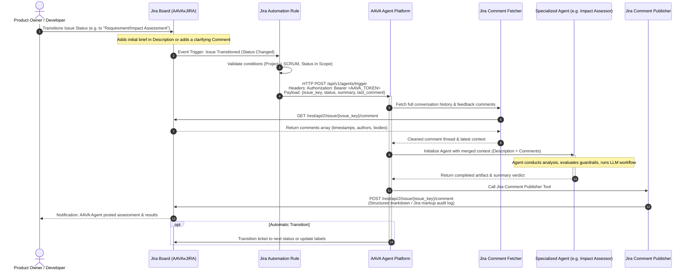
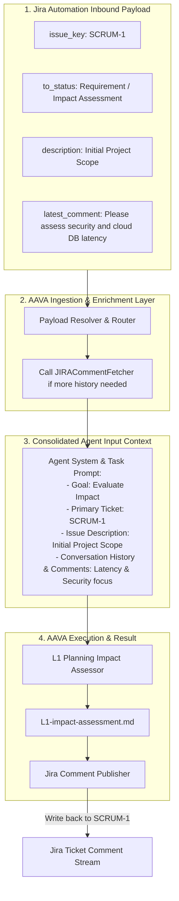
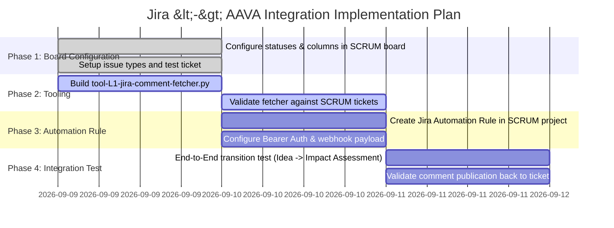

# End-to-End Jira <-> AAVA Integration Architecture & Implementation Guide

---

## 1. Executive Summary & Objective

This document outlines the end-to-end integration architecture and execution plan to trigger **AAVA (Ascendion Autonomous Value Accelerator)** agentic workflows directly from **Jira** via native **Jira Automation**.

### Project Context
* **Jira Workspace:** `https://worktejasc.atlassian.net`
* **Jira Project:** `SCRUM`
* **Dedicated Board / Space:** `AAVAxJIRA INTEGRATION`
* **Board URL:** [AAVAxJIRA INTEGRATION Board](https://worktejasc.atlassian.net/jira/software/projects/SCRUM/boards/1?filter=&groupBy=none)
* **Goal:** Enable bi-directional communication between Jira and AAVA:
  1. Trigger agentic runs when issue statuses or labels transition (e.g., Idea $\rightarrow$ Vision $\rightarrow$ Requirement / Impact Assessment).
  2. Read and extract context from Jira issue details and previous **Jira Comments** as dynamic input to the AAVA payload.
  3. Execute AAVA agents autonomously with security tokens (Bearer Auth).
  4. Write agent analysis, verdicts, specifications, and generated artifacts back to the Jira ticket as **Comments** via the existing Jira Comment Publisher.

---

## 2. Current State vs. Target State

| Capability | Current State | Target State |
| :--- | :--- | :--- |
| **Jira Comment Publisher** | ✅ **Built & Working** (`tool-L1-jira-comment-publisher.py`) | Integrated into agent completion callback. |
| **Jira Comment Fetcher** | ❌ **Missing** (Tickets can only be written to, not read from comments) | 🚀 **To Build**: Dedicated tool to fetch comment history/latest comment. |
| **AAVA Agent Jira Writing** | ✅ **Built** (Agents can update tickets and publish comments) | Multi-stage pipeline writing back to audit logs. |
| **Status / Labels State Machine** | ⚠️ Generic Scrum board (`To Do`, `In Progress`, `Done`) | 🚀 Customized states: `Idea`, `Vision`, `Requirement / Impact Assessment`, etc. |
| **Jira Automation Trigger** | ❌ Not configured | 🚀 Configured with "Send Web Request" using Bearer Token. |
| **Dynamic Payload Construction** | ⚠️ Static / manual | 🚀 Dynamic extraction using Jira Smart Values + Comment Fetcher. |

---

## 3. End-to-End Workflow Architecture



---

## 4. Status Workflow & State Machine Design

To enable seamless handoffs between human stakeholders and autonomous agents, the Jira Board will use structured statuses representing the Software Development Lifecycle stages:

```mermaid
stateDiagram-v2
    [*] --> Idea: Human writes raw concept
    Idea --> Vision: Status change triggers Vision Agent
    Vision --> Requirement_ImpactAssessment: Vision approved; triggers Impact Assessment Agent
    Requirement_ImpactAssessment --> Epic_Story_Breakdown: Architecture & scope cleared; triggers Story Generator
    Epic_Story_Breakdown --> Technical_Design: Epics & stories created; triggers HLD/LLD Agent
    Technical_Design --> Done: Artifacts published & validated
```



### Stage Breakdown & Agent Trigger Mapping

| Stage / Status | Trigger Event | Primary Input Source | AAVA Agent Triggered | Output Artifact Posted to Comments |
| :--- | :--- | :--- | :--- | :--- |
| **`Idea`** | Created by Human | Jira Description + Initial Notes | None (Human ideation phase) | Initial scope document |
| **`Vision`** | Status transitioned to `Vision` | Issue Description + Comments | **Vision Formulator & Value Scoper** | Product Vision Document, Target Personas, Success Metrics |
| **`Requirement / Impact Assessment`** | Status transitioned to `Requirement / Impact Assessment` | Vision Comment + New Human feedback comments | **Planning Impact Assessor & Architect** | Enterprise Impact Assessment, Architectural Dependencies, Feasibility Verdict |
| **`Epic & Story Breakdown`** | Status transitioned to `Epic & Story Breakdown` | Approved Impact Assessment comment | **User Story & Epic Generator** | Formatted Epics, User Stories, Acceptance Criteria, Gherkin Scenarios |
| **`Technical Design`** | Status transitioned to `Technical Design` | Epics + Technical feedback comments | **API Spec & LLD Designer** | OpenAPI Specs, Sequence Diagrams, Component LLD |

---

## 5. Jira Automation Setup (Step-by-Step)

Jira Cloud provides a native Automation engine located under **Project Settings $\rightarrow$ Automation**.

### Rule Configuration: "Trigger AAVA on Status Transition"

#### 1. Trigger
* **Component:** `Issue transitioned`
* **Configuration:**
  * **From status:** Any status
  * **To status:** `Vision`, `Requirement / Impact Assessment`, `Epic & Story Breakdown` (or customized status)

#### 2. Condition (Filter & Infinite Loop Guard)
* **Component:** `Issue fields condition`
* **Configuration:**
  * Prevent recursive triggering: Ensure the update was not performed by the AAVA Automation bot user.
  * Check: `Project = SCRUM`
  * Optional: Check label contains `aava-enabled`

#### 3. Action: Send Web Request
* **Component:** `Send web request`
* **Web request URL:** `<AAVA_ORCHESTRATOR_WEBHOOK_URL>` (e.g. `https://aava-api.ascendion.com/api/v1/workflows/trigger`)
* **HTTP Method:** `POST`
* **Web request headers:**
  ```http
  Authorization: Bearer <AAVA_BEARER_TOKEN>
  Content-Type: application/json
  Accept: application/json
  ```
* **HTTP Body (Custom data with Jira Smart Values):**
  ```json
  {
    "trigger_event": "jira_status_change",
    "project_key": "{{issue.project.key}}",
    "issue_key": "{{issue.key}}",
    "issue_id": "{{issue.id}}",
    "status": {
      "from": "{{fieldChange.fromString}}",
      "to": "{{issue.status.name}}"
    },
    "summary": {{issue.summary.asJsonString}},
    "description": {{issue.description.asJsonString}},
    "labels": [
      {{#issue.labels}}"{{.}}"{{^last}},{{/last}}{{/issue.labels}}
    ],
    "initiator": {
      "displayName": {{initiator.displayName.asJsonString}},
      "emailAddress": {{initiator.emailAddress.asJsonString}}
    },
    "latest_comment": {
      "id": "{{issue.comments.last.id}}",
      "author": {{issue.comments.last.author.displayName.asJsonString}},
      "body": {{issue.comments.last.body.asJsonString}},
      "created": "{{issue.comments.last.created}}"
    },
    "jira_base_url": "https://worktejasc.atlassian.net"
  }
  ```

> [!IMPORTANT]
> Always use `.asJsonString` in Jira Smart Values (e.g., `{{issue.description.asJsonString}}`) to properly escape multi-line text, line breaks, and quotes so that the payload produces valid JSON.

---

## 6. Tool Specification: Jira Comment Fetcher

To complete the bi-directional cycle, we introduce the **Jira Comment Fetcher** tool.

### Architecture & Specification
* **Target File:** `agent-factory/tools/jira/tool-L1-jira-comment-fetcher/tool-L1-jira-comment-fetcher.py`
* **Jira Endpoint:** `GET /rest/api/2/issue/{issue_key}/comment` (or `v3`)
* **Core Responsibilities:**
  1. Retrieve all comments for a given `issue_key`.
  2. Filter out comments created by the agent itself (using author matching or tags like `[AAVA-AGENT-AUDIT]`) to locate human feedback.
  3. Extract the latest user feedback comment or full conversation history.
  4. Return structured JSON with clean text representation.

### Tool Schema & Interface

```python
class JIRACommentFetcherSchema(BaseModel):
    issue_key: str = Field(..., description="JIRA issue key (e.g., SCRUM-12)")
    max_results: Optional[int] = Field(20, description="Max number of comments to return (default 20)")
    latest_only: Optional[bool] = Field(False, description="If True, returns only the most recent comment")
    human_only: Optional[bool] = Field(False, description="If True, filters out comments posted by automated agent bots")
```

### Proposed Tool Implementation

```python
import os
import requests
from typing import Any, Type, Dict, List, Optional
from pydantic import BaseModel, Field
from crewai.tools import BaseTool
from requests.auth import HTTPBasicAuth
import urllib3

urllib3.disable_warnings(urllib3.exceptions.InsecureRequestWarning)

class JIRACommentFetcherSchema(BaseModel):
    issue_key: str = Field(..., description="JIRA issue key (e.g., SCRUM-12)")
    max_results: Optional[int] = Field(20, description="Max number of comments to retrieve")
    latest_only: Optional[bool] = Field(False, description="If True, returns only the single latest comment")
    human_only: Optional[bool] = Field(False, description="Exclude comments posted by AAVA agent bots")

class JIRACommentFetcher(BaseTool):
    '''
    JIRACommentFetcher - Reads comments from a JIRA issue via REST API.
    Provides conversation history and user feedback to AAVA agents.
    '''
    name: str = "JIRA Comment Fetcher"
    description: str = "A tool to read comments and user feedback from a JIRA ticket."
    args_schema: Type[BaseModel] = JIRACommentFetcherSchema
    jira_url: str = "https://worktejasc.atlassian.net"

    def _run(self, issue_key: str, max_results: int = 20, latest_only: bool = False, human_only: bool = False) -> Dict[str, Any]:
        try:
            username = os.environ.get("JIRA_USERNAME", "work.tejasc@gmail.com")
            api_token = os.environ.get("JIRA_API_TOKEN")

            if not api_token:
                return {"success": False, "error": "Missing JIRA_API_TOKEN in environment."}

            url = f"{self.jira_url.rstrip('/')}/rest/api/2/issue/{issue_key}/comment"
            auth = HTTPBasicAuth(username, api_token)
            headers = {"Accept": "application/json"}

            response = requests.get(url, headers=headers, auth=auth, timeout=30)
            if response.status_code != 200:
                return {
                    "success": False,
                    "status_code": response.status_code,
                    "error": f"Failed to fetch comments: {response.text}"
                }

            data = response.json()
            raw_comments = data.get("comments", [])

            parsed_comments = []
            for c in raw_comments:
                author_name = (c.get("author") or {}).get("displayName", "Unknown")
                body = c.get("body", "")

                # Skip bot comments if human_only requested
                is_bot = "[AAVA" in body or author_name.lower().startswith("aava")
                if human_only and is_bot:
                    continue

                parsed_comments.append({
                    "comment_id": c.get("id"),
                    "author": author_name,
                    "created": c.get("created"),
                    "updated": c.get("updated"),
                    "is_bot": is_bot,
                    "body": body
                })

            if latest_only and parsed_comments:
                return {
                    "success": True,
                    "issue_key": issue_key,
                    "total_comments": len(raw_comments),
                    "comment": parsed_comments[-1]
                }

            return {
                "success": True,
                "issue_key": issue_key,
                "total_comments": len(raw_comments),
                "comments": parsed_comments[-max_results:]
            }

        except Exception as e:
            return {"success": False, "issue_key": issue_key, "error": str(e)}
```

---

## 7. Dynamic Payload Construction for AAVA

When Jira triggers AAVA, the orchestrator extracts the required variables to invoke the target agent:



### AAVA Execution Payload Specification

```json
{
  "workflow_id": "wf-planning-impact-assessment",
  "execution_mode": "async",
  "auth": {
    "token_type": "Bearer"
  },
  "inputs": {
    "jira_issue_key": "{{issue.key}}",
    "jira_board_url": "https://worktejasc.atlassian.net/jira/software/projects/SCRUM/boards/1",
    "ticket_summary": "{{issue.summary}}",
    "ticket_description": "{{issue.description}}",
    "user_feedback_comment": "{{issue.comments.last.body}}",
    "target_stage": "Requirement / Impact Assessment"
  },
  "callback": {
    "publish_to_jira": true,
    "destination_issue_key": "{{issue.key}}",
    "transition_on_success": "Epic & Story Breakdown"
  }
}
```

---

## 8. Preventing Common Pitfalls & Edge Cases

1. **Infinite Automation Loops**:
   * *Problem:* Agent posts comment $\rightarrow$ Jira triggers automation $\rightarrow$ Agent runs $\rightarrow$ Agent posts comment $\rightarrow$ loop.
   * *Solution:* 
     * Bind trigger strictly to **`Issue transitioned` (Status change)**, NOT to `Issue commented`.
     * If triggering on comments, add a condition: `comment.author.emailAddress != "work.tejasc@gmail.com"` (or dedicated bot service account) and ensure comments starting with `[AAVA-AGENT-AUDIT]` are ignored.
2. **Payload Size & Truncation**:
   * *Problem:* Tickets with 50+ comments or massive descriptions can exceed webhook payload limits.
   * *Solution:* The Jira Automation rule passes only metadata (`issue_key`, `summary`, `last_comment`). The AAVA agent uses `JIRACommentFetcher` to cleanly pull only the relevant slice of comments on demand.
3. **Authentication & Secret Security**:
   * *Problem:* Leaking bearer tokens or API tokens in rule logs.
   * *Solution:* Use Jira Automation's **Hidden Secret Headers** feature when configuring the Webhook, keeping `Authorization` bearer tokens masked.

---

## 9. Actionable Implementation Roadmap



1. **Step 1: Setup Jira Board Statuses**
   * Go to [SCRUM Board Settings](https://worktejasc.atlassian.net/jira/software/projects/SCRUM/boards/1).
   * Map board columns to workflow statuses:
     `Idea` $\rightarrow$ `Vision` $\rightarrow$ `Requirement / Impact Assessment` $\rightarrow$ `Epic & Story Breakdown` $\rightarrow$ `Done`.

2. **Step 2: Implement & Test Comment Fetcher Tool**
   * Create `agent-factory/tools/jira/tool-L1-jira-comment-fetcher/tool-L1-jira-comment-fetcher.py`.
   * Unit test against existing tickets on `worktejasc.atlassian.net`.

3. **Step 3: Setup Jira Automation Webhook**
   * Configure Jira Automation rule triggered on `Issue transitioned`.
   * Add header: `Authorization: Bearer <AAVA_BEARER_TOKEN>`.
   * Add body with smart values passing `{{issue.key}}`, `{{issue.summary.asJsonString}}`, etc.

4. **Step 4: End-to-End Verification**
   * Create a sample ticket in `SCRUM` (e.g. `SCRUM-1`).
   * Add initial comments / requirements.
   * Transition ticket to `Requirement / Impact Assessment`.
   * Verify AAVA receives webhook, pulls comments, executes agent, and posts verdict comment back to `SCRUM-1`.
